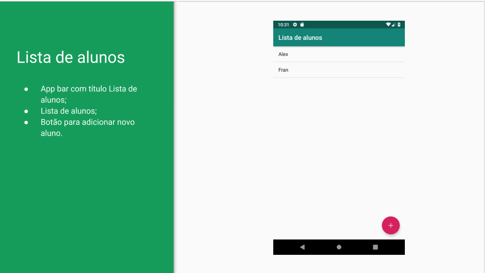
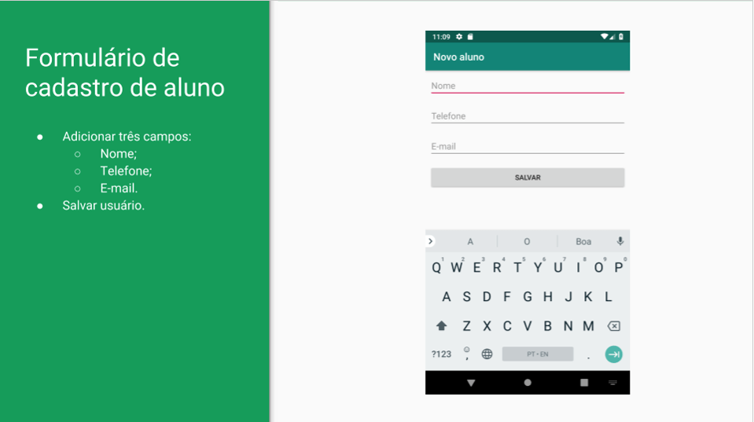

# Lista Alunos App
Repositório voltado para o curso de Desenvolvimento Android "Parte 1: Crie a sua primeira APP mobile" curso desenvolvido pela Alura e promovido pela Fundação Bradesco.

O curso foi divido em 5 aulas, sendo elas: 

* Criando o primeiro App;
* Aplicandoi layouts para Activities;
* Entendendo a base de construção de layouts;
* Trabalhando com arquivo fonte do layout;
* Finalizando o fluxo do App;

Se tratando de um curso inicial, viu-se o básico da programa de Aplicativos em Java e as próprias features do Android Studio. Conceitos como Activities, Configuranção do Manifest, Implementação das telas, botões e listas.
O aplicativo proposto se trata de um simples cadastro de alunos com nome, telefone e e-mail, sendo a tela inicial uma lista com os alunos cadastrados no aplicativo.
Se trata do desenvolvimento de somento duas telas, como apresentado a seguir:

## Tela incial com a lista de alunos cadastrados:

## Tela de cadastro de alunos:

